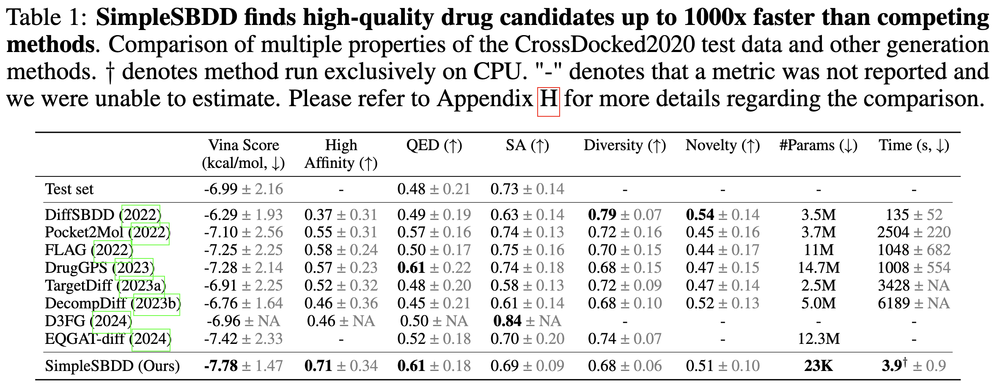

# Simple Structure-Based Drug Design

This repository is the official implementation of SimpleSBDD models introduced in [What Ails Generative Structure-based Drug Design: Expressivity is Too Little or Too Much?](https://openreview.net/forum?id=GHyBMTpiJg) (AISTATS'25 oral).


## Requirements

To prepare the environment (`python 3.9`): :

```setup
pip install -r requirements.txt
```

## Data

### CrossDocked2020 Dataset

Download the CrossDocked2020 dataset following the instructions in https://github.com/pengxingang/Pocket2Mol/blob/main/data/README.md and place it in the `data` folder.

### Binding Affinity scoring model training data

We provide a CSV file of the training data for the scoring model described in Section 4.2 of the paper. It has four columns:
 * `protein_path` - path to a PDB file in the CrossDocked2020 dataset describing the protein pocket
 * `ligand_smiles` - SMILES string of the ligand
 * `vina_score` - binding affinity estimation made by Vina
 * `split_name` - whether an example comes from TRAINING or VALIDATION subset

### MoFlow model weights

In order to use the novel drug generation and property optimization versions of the models, one must download model weights of the generative model MoFlow.
We use the weights of the model trained on ZINC dataset.
The instructions on how to download them can be found in the official repository: https://github.com/calvin-zcx/moflow/blob/master/README.md.
The recommended directory for placing the weights is `moflow/mflow/results`

## Training

To train the scoring model:

```scoring_model_training
python train_scoring_model.py --protein_encoder_n_layers 3 --n_iter 10000 --output_checkpoint_name scoring_model_retrained
```

To train the center of mass predictor:

```com_model_training
python train_com_model.py --hidden_dim 16 --n_layers 4 --n_iter 10000 --output_checkpoint_name com_model_retrained
```

## Sampling

To generate ligands, run:

```sampling
python sampling.py --train_test_pairs_file_path data/split_by_name.pt --cross_docked_data_dir data/crossdocked_pocket10 --n_samples_per_pocket 10 --model_type DR --experiment_name fastsbdd_dr
```
Possible values for `model_type` are `[DR, ND, PO]` standing for drug repurposing, novel drug generation and property optimization respectively.

## Evaluation

To run evaluation, we create a separate environment (which needs to run python2.7) as in https://github.com/pengxingang/Pocket2Mol. After creating and activating the environment as described in that repository, run:

```eval
python evaluation/evaluate.py --results_pairs experiment_name_eval_input_local.pt  --out_dir experiment_name_results --exp_name experiment_name
```
where `experiment_name_eval_input_local.pt` was created by the sampling script described above.

## Pre-trained Models

All pre-trained models are placed in the `checkpoints` folder.

## Results

Our model achieves the following performance:



## Reference

If you find this work useful, please consider citing

```
@inproceedings{
karczewski2025what,
title={What Ails Generative Structure-based Drug Design: Expressivity is Too Little or Too Much?},
author={Rafał Karczewski and Samuel Kaski and Markus Heinonen and Vikas K Garg},
booktitle={The 28th International Conference on Artificial Intelligence and Statistics},
year={2025},
url={https://openreview.net/forum?id=GHyBMTpiJg}
}
```
